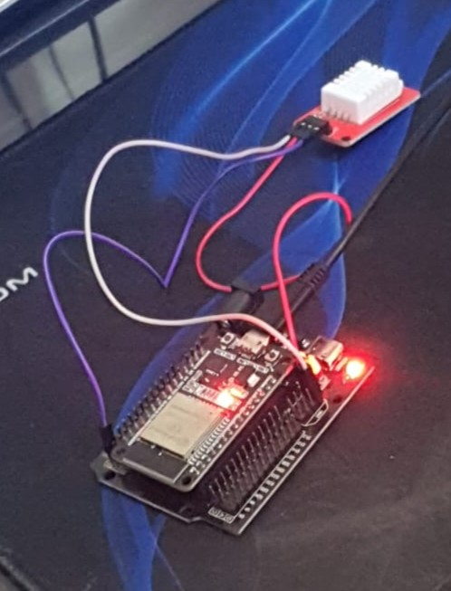

# IOT - Agro Guard
### Aplicação cujo objetivo é auxiliar os produtores na sua plantação, disponibilizando dados da temperatura e umidade.

## Objetivo
<p> Esse repositório concentra todas as informações do IOT do projeto. </p>

## Tecnologias e sensores
<p> - ESP32 </br>
    - Sensor DHT22 </br>
    - Biblioteca HTTPClient </br>
</p>

## Imagem do sensor
</br>

## Funcionamento
<p>Através de um código em C++, após a captura dos dados pelo sensor DHT22, é enviado uma requisão POST para API que pega esses dados e salva-os no banco de dados. </p>

## Execute o projeto
<h4>Para executar o projeto é NECESSÁRIO ter o sensor DHT22 e uma ESP32/Arduino</h4>

```bash
# Clone este repositório
$ git clone <https://github.com/GuihCFerreira/PI-IOT>

# Acesse a pasta do projeto no terminal/cmd
$ cd PI-IOT
```
<p>Após isso, conecte o arduino no computador e coloque para executar o projeto.</p>

## Desenvolvido
<p>Todo o projeto foi desenvolvido pelos alunos: </br></p>
<p>Cayk Andrade Magnani,</br>Guilherme de Carvalho Ferreira e</br> Lucas Gean dos Santos.</p> 
